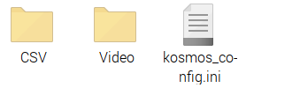

# Kosmos Software

<details open>
 <summary> Sommaire </summary>
 
  * [Installation](https://github.com/KonkArLab/kosmos_software/blob/Refonte_fromIMT2/READ_ME.md#installation)
  * [Mode d'emploi](https://github.com/KonkArLab/kosmos_software/blob/Refonte_fromIMT2/READ_ME.md#mode-demploi)
    
</details>
<br>

## Installation
### Installation du système d'exploitation (OS) de la Raspberry  
Sur un PC :  
 - Installer [l'imageur Raspberry Pi](https://www.raspberrypi.com/software/)  
 - Choisir le modèle de carte : Raspberry Pi 4  
 - Choisir le système d'exploitation : Raspberry Pi OS (64 bit), Debian Bookworm
 - Choisir pour emplacement de stockage votre carte SD  
<br>

Plusieurs fenêtres vont apparaître:  
> Voulez-vous appliquer les réglages de personnalisation de l'OS ?  
> - Cliquer sur `Non`


> Toutes les données vont être supprimées. 
> - Cliquer sur `Oui` et l'installation commence. Elle peut durer quelques minutes.

> Raspberry Pi Os a bien été écrit.  
> - Cliquer sur `Continuer`  

<br>

[comment]: <### Changement du fichier config>
[comment]: <Toujours sur un PC,  >
[comment]: < - Remplacer le fichier config.txt du boot de la carte SD par celui présent dans le fichier kosmos_software du Github.>

### Premier démarrage de la RPi.  
Une connexion ethernet filaire plutôt que Wifi est recommandée.
  
 - Démarrer la Raspberry Pi avec la carte SD, la carte RPi est allumée lorsque les petites leds de la carte clignotent. Le démarrage peut prendre un peu de temps.  
Plusieurs fenêtres vont s'afficher:   
> Welcome to Raspberry Pi Desktop !  
> - Cliquer sur `Next`  
> - Choisir le pays : France  
> - Choisir la langue : French  
> - Choisir la time zone : Paris  
> - Cliquer sur `Next`    
  
> Create User  
> - Compléter les informations demandées. Mettre pour username `kosmos` et pour mot de passe `kosmos` 
> - Cliquer sur `Next`
  
> Set up Screen  
> - Cliquer sur `Next`
  
> Select Wifi Network  
> - Cliquer sur `Next`  
  
> Update Software  
> - Cliquer sur `Next` (et non sur `Skip` sinon les mises à jour ne seront pas effectuées. Cette opération peut prendre quelques minutes.)  
  
> System is up to date  
> - Cliquer sur `Ok`  
  
> Set up complete  
> - Cliquer sur `Restart`  

### Première installation du logiciel KOSMOS
 - Ouvrir un terminal et taper la commande suivante:
```
sudo raspi-config		//Ouvre les paramètres de configuration de la raspberry
```
<br>

Un menu s'affiche, utiliser le clavier pour sélectionner les paramètres souhaités (pas de souris).  
Se déplacer avec les flèches et sélectionner les paramètres en appuyant sur Entrée. 

 [comment]: <- Dans le menu, aller dans `6 Advanced Options` puis dans `AA Network Config` choisir `NetworkManager`	> 
  
 [comment]: <- Aller ensuite dans `3 Interface options`  >
 [comment]: <pour `I1 Legacy Caméra` choisir `enable`  >

 - Aller dans `3 Interface Options` puis dans `I2 VNC` choisir `Enable`	 
   
 - Aller dans `Finish` puis sélectionner `Oui`.   

### Création d'un point Hotspot pour l'application KosmosWeb
[comment]: <Une fois la RPi redémarrée,>   
- Aller dans l'onglet Wifi (icone avec deux flèches de sens inversées) pour créer un Hotspot Wifi :
- Aller dans `Advanced Options`  
- Cliquer sur `Create Wifi Hospot`  
- Lui donner un nom `KosmosWeb2` où 2 est un numéro permettant de distinguer les systèmes kosmos entre eux 
- Ne pas mettre de sécurité sur le réseau  
- Cliquer sur `Créer`  
 
 Modification des paramètres de connexion par défaut afin que le hotspot se lance automatiquement au démarrage de la Rpi. 
 
- Retourner dans l'onglet Wifi
- Aller dans `Advanced options`  
- Aller dans `Modifier les connexions`    
- Choisir le réseau Hotspot  
- Sélectionner le réseau créé `KosmosWeb2`  et aller dans les paramètres (icone en forme d'engrenage)
- Aller dans l'onglet `Général` tout à gauche.
- Cocher `Connect Automatically with priority`, cela vous permettra de vous reconnecter directement lorsque le système effectuera un reboot  
- Cliquer sur `Enregistrer`

### Importation du dossier software
Dans un terminal taper les commandes suivantes:  
```
git clone https://github.com/KonkArLab/kosmos_software.git		//Clone le dossier kosmos_software depuis le git
cd kosmos_software							//Ouvre le dossier kosmos_software
```
<br>

```
sudo chmod 755 install.sh		//Rend exécutable le fichier install.sh
sh install.sh				//Lance le fichier install.sh
```  
<br>
Une question apparaît dans le terminal:  

> Souhaitez-vous continuer ?[O/n]  
> - Appuyer sur `Entrée` pour continuer et finir l'exécution de la commande précédente
  
### Stockage des données

 - Brancher la clé USB pour le stockage des données. Elle peut être vide ou contenir déjà les dossiers CSV et Video d'un précédente campagne. (Nous recommandons toutefois de repartir d'une clé vierge pour éviter des incompatibilités dues à l'évolution du software.) 
  
 - Redémarrer maintenant la RPi. Si au démarrage, la led verte de la carte électronique clignote c'est que le système est opérationnel. Si la clé était vierge, elle doit maintenant contenir deux dossiers et un ficher texte :



Le fichier kosmos_config.ini contient les paramètres de configuration du système. Ces paramètres seront visibles depuis l'interface web grâce à un ficher Javascript. [Explication](https://github.com/KonkArLab/kosmos_software/blob/Refonte_fromIMT2/READ_ME.md#configuration)  

Vos fichiers enregistrés avec kosmos seront sauvegardés dans les dossiers CSV et Video.
Les fichiers vidéos et csv ne sont pas effacés à chaque démarrage. Si vous avez déjà enregistré des vidéos elles resteront stockées dans ces fichiers. 

## Mode d'emploi
### Processus de mise à l'eau
Pour déployer KOSMOS en mer suivre le [guide de mise en service](https://kosmos.fish/index.php/deployer/).

### Prise en main de l'Interface web
Une IHM (Interface Homme Machine) a été développée et permet de commander Kosmos depuis un téléphone. Elle remplace les étapes à réaliser avec les aimants dans le guide de mise en service. (À noter que le fonctionnement avec les aimants est toujours opérationnel.)

Sur un téléphone ou un ordinateur portable:
 - Se connecter au réseau  WiFi de la raspberry qui a été créé dans les étapes précédentes  
 - Dans un navigateur web entrer l'adresse 10.42.0.1 qui permet d'accéder à l'interface de commande du KOSMOS


En haut de l'écran il y a 3 onglets:
 * Camera
 * Records
 * Configuration
 * Checklist
   
    
<br>

 
##### Camera
###### State
Affiche l'état dans lequel se trouve la caméra  

 - UNKNOW : état inconnu (signe d'un mauvais fonctionnement)
 - STARTING : kosmos est en train de démarrer
 - STANDBY : kosmos est en attente
 - WORKING : kosmos entame l'enregistrement
 - STOPPING : kosmos termine l'enregistrement
 - SHUTDOWN : kosmos passe à l'arrêt total

###### Buttons
 - `Start` démarre un enregistrement vidéo
 - `Stop` arrête l'enregistrement vidéo en cours

###### Live video
 - `Start Live` affiche ce qu'observe la caméra. (Ce live vidéo ne fonctionne que dans l'état STANDBY.)
 - `Stop Live` arrête l'affichage de ce qu'observe la caméra

###### ShutDown KOSMOS
 - `Shutdown` éteint kosmos
<br>

##### Records
Affiche le nom, la taille et l'heure de fin d'enregistrement des derniers fichiers vidéos.
<br>

##### Configuration
Permet de modifier des paramètres du système  
Un fichier javascript vient lire le fichier kosmos_config.ini.  
Puis il va créer une liste avec les différents noms des paramètres écrits dans le fichier kosmos_config.ini. Les noms des paramètres seront associés à un label et les valeurs des paramètres seront associées à un input. Par défaut l'input est en "readonly" c'est à dire qu'il n'est pas modifiable. Pour pouvoir le modifier il faut appuyer sur le bouton `Modify` entrer la nouvelle valeur puis la sauvegarder avec `Save`. Une fois la valeur sauvegardée le fichier kosmos_config.ini se mettra à jour.  
Il est également possible de modifier les paramètres directement dans le fichier kosmos_config.ini.

 - `00_SYSTEM_mode = 1` permet de permuter entre les modes de fonctionnement du KOSMOS, seul le mode STAVIRO [1] existe pour le moment.  
 - `01_SYSTEM_record_button_gpio = 17` adresse gpio du bouton début/arrêt de l'enregistrement 
 - `02_SYSTEM_stop_button_gpio = 23` adresse gpio du bouton d'arrêt du système
 - `03_SYSTEM_led_b = 4` adresse gpio de la LED verte
 - `04_SYSTEM_led_r = 18` adresse gpio de la LED rouge
 - `05_SYSTEM_shutdown = 1`  permet d'éteindre ou non la Rpi lorsque le bouton arrêt est pressé. 
    * si `0` lors du shutdown le programme s'arrête mais la Rpi reste allumée (utiliser ce réglage pour le debug ou le développement software)
    * si `1` lors du shutdown le programme s'éteint (privilégier ce mode sur le terrain)
 - `06_SYSTEM_moteur = 1`  Active ou désactive le moteur
    * si `0` Moteur désactivé
    * si `1` Moteur activé
 - `07_SYSTEM_tps_fonctionnement = 1800` Règle le temps en secondes avant l'extinction automatique du système. Ce réglage permet d'éviter un déchargement complet des batteries ce qui les rendrait inutilisables.
<br>

 - `10_MOTOR_esc_gpio = 22` adresse gpio de l'esc qui pilote le moteur (c'est un signal PWM)
 - `11_MOTOR_power_gpio = 27` adresse gpio du relai qui alimente le moteur
 - `12_MOTOR_button_gpio = 21` adresse gpio de l'ILS qui permet d'asservir la croix de Malte
 - `13_MOTOR_vitesse_min = 1000` vitesse minimale du moteur utilisée lors de son armement (peut-être inutile...)
 - `14_MOTOR_vitesse_favorite = 1350` vitesse nominale du moteur. A régler avant le départ en mission. Typiquement entre 1200 & 1600.
 - `15_MOTOR_pause_time = 27`  temps de pause en secondes entre les rotations (typiquement 27 secondes pour le protocole STAVIRO)
 - `16_MOTOR_inertie_time = 1000` temps en ms qui permet de décaler l'aimant d'asservissement du moteur suffisamment loin de l'ILS afin d'éviter son activation fortuite. A régler avant le départ en mission. Typiquement entre 500 et 2000.
<br>

 - `20_CSV_step_time = 5` Temps d'échantillonnage en secondes des données CSV (heure, pression, T°)
 - `21_CSV_file_name = CSV_Kosmos2` début du nom des fichiers csv
<br>

 - `30_PICAM_file_name = Video_Kosmos2` début du nom des fichiers vidéos
 - `31_PICAM_resolution_x = 1920` résolution de l'image selon l'axe des x (typiquement 1920)
 - `32_PICAM_resolution_y = 1080` résolution de l'image selon l'axe des y (typiquement 1080)
 - `33_PICAM_preview = 0` Affiche ce que voit la caméra pendant qu'elle enregistre
    * si `0` pas d'aperçu (CHOISIR IMPERATIVEMENT CE MODE SURT LE TERRAIN)
    * si `1` affiche un aperçu de ce qu'observe la caméra sur l'écran (utile pour le développement et le débug car ne fonctionne qu'avec un lancement de kosmos_main.py via la terminal)
 - `34_PICAM_framerate = 24` nombre d'images enregistrées par seconde (typiquement 24)
 - `35_PICAM_record_time = 1600` temps d'enregistement en secondes (typiquement 1600 secondes) des séquences vidéos. Si le système doit filmer plus longtemps que ce temps d'enregistrement, la vidéo sera découpée en plusieurs séquences. Ceci permet d'éviter la perte de données si un arrêt brutal se produit.
 - `36_PICAM_conversion_mp4 = 1`  
    * si `0` ne convertit pas les fichiers vidéos en mp4 et les laisse en h264.
    * si `1` convertit les fichiers vidéos en mp4 et supprime les h264
 - `37_PICAM_awb = 0` permet de définir le mode de fonctionnement de l'Automatic White Balance (seul le mode 0 fonctionne pour le moment)
 - `38_PICAM_timestamp = 0` incruste ou non une horloge dans l'image
    * si `0` pas d'incrustation
    * si `1` incrustation
