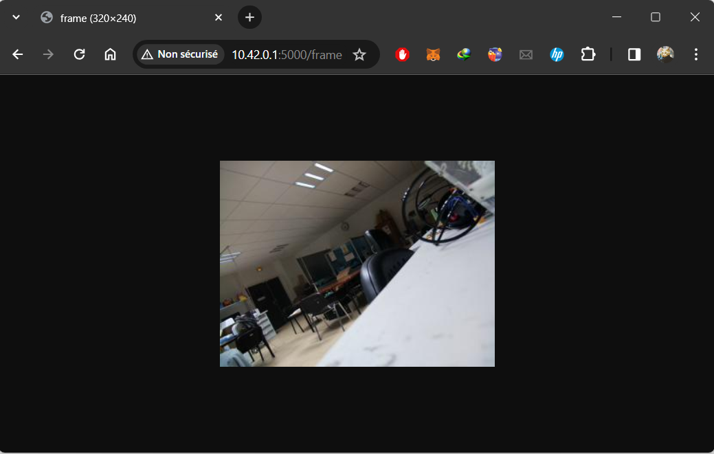

# Kosmos Software v2

## Description du Projet

Ce projet est une branche du dépôt **KOSMOS_SOFTWARE** du **KonkArLab**, qui ajoute une deuxième alternative de commande pour la caméra Kosmos : le contrôle par les interrupteurs Reed reste fonctionnel. À cela s'ajoute une application web qui fait les mêmes choses que les interrupteurs tout en ajoutant en même temps d'autres fonctionnalités.

On peut résumer toutes les fonctionnalités de l'application web par ce qui suit :

- Activer ou désactiver l'enregistrement.
- Voir la caméra en flux direct avant l'enregistrement.
- Consulter l'état du système.
- Configurer et consulter les paramètres de la caméra.
- Consulter les derniers enregistrements.

## Description de la Partie Backend

### Technologie Utilisée

Vu que le logiciel de base est développé en langage Python, nous avons décidé d'utiliser Flask, un micro-framework open-source de développement web en Python. Il est classé comme micro-framework car il est très léger. Flask a pour objectif de garder un noyau simple mais extensible.

### Description des API

- GET /state :
  Cette requête retourne l'état du système

  #### Exemple de réponse :

  ```json
  {
    "state": "KState.STANDBY",
    "status": "ok"
  }
  ```

  #### Implémentation

  ```python
  def state(self):
      return {
          "status" : "ok",
          "state" : str(self.myMain.state)
      }
  ```

- GET /start :
  Cette requête démarre l'enregistrement.

  #### Exemple de réponse :

  ```json
  {
    "status": "ok"
  }
  ```

  #### Implémentation

  ```python
  def start(self):
  if(self.myMain.state==KState.STANDBY):
      self.myMain.record_event.set()
      self.myMain.button_event.set()
      return {
          "status" : "ok"
      }
  else :
      return {
          "status" : "error"
      }
  ```

- GET /stop :
  Cette requête arrête l'enregistrement.

  #### Exemple de réponse :

  ```json
  {
    "status": "ok"
  }
  ```

  #### Implémentation

  ```python
  def stop(self):
      if(self.myMain.state==KState.WORKING):
          self.myMain.record_event.set()
          self.myMain.button_event.set()
          return {
              "status" : "ok"
          }
      else :
          return {
              "status" : "error"
          }
  ```

- POST /changeConfig :
  Cette requête change la configuration.

  #### Exemple de body requete :

  ```json
  {
    "sett_video_file_name": "testFileName"
  }
  ```

  #### Exemple de réponse :

  ```json
  {
    "status": "ok"
  }
  ```

  #### Implémentation

  ```python
  def changeConfig(self):
      if(self.myMain.state==KState.STANDBY):
          data = request.json
          for key in data:
              self.myMain._conf.set_val(key,data[key])
          self.myMain._conf.update_file()
          self.myMain.thread_camera.closeCam()
          del self.myMain.motorThread
          del self.myMain.thread_camera
          self.myMain.init()
          self.myMain.button_event.set()
          return {
              "status" : "ok"
          }
      else:
          return {
              "status" : "error"
          }
  ```

- GET /getConfig :
  Cette requête retourne toute la configuration actuelle.

  #### Exemple de réponse :

  ```json
  {
    "data": {
      "sett_csv_file_name": "Kosmos_CSV",
      "sett_csv_step_time": "5",
      "sett_esc_motor_favorite_val": "1350",
      "sett_esc_motor_gpio": "22",
      "sett_esc_motor_max_val": "2100",
      "sett_esc_motor_min_val": "1000",
      "sett_framerate": "24",
      "sett_led_b": "4",
      "sett_led_r": "18",
      "sett_mode": "1",
      "sett_motor_button_gpio": "21",
      "sett_motor_run_time": "5",
      "sett_motor_stop_time": "27",
      "sett_power_motor_gpio": "27",
      "sett_record_button_gpio": "17",
      "sett_record_time": "400",
      "sett_shutdown": "1",
      "sett_stop_button_gpio": "23",
      "sett_video_file_name": "test2",
      "sett_video_preview": "0",
      "sett_video_resolution_x": "1920",
      "sett_video_resolution_y": "1080"
    },
    "status": "ok"
  }
  ```

  #### Implémentation

  ```python
  def getConfig(self):
      response=dict()
      response["data"]=dict(self.myMain._conf.config["KOSMOS"])
      response["status"]="ok"
      return response
  ```

- GET /getRecord :
  Cette requête retourne des informations sur les derniers enregistrements.

  #### Exemple de réponse :

  ```json
  {
    "data": [
      {
        "day": "9",
        "fileName": "test2_2023-12-09-16-25-48.h264",
        "month": "Dec",
        "size": "240.4268",
        "time": "16:32"
      },
      {
        "day": "9",
        "fileName": "test2_2023-12-09-16-26-07.h264",
        "month": "Dec",
        "size": "9.1890",
        "time": "16:26"
      },
      {
        "day": "9",
        "fileName": "test2_2023-12-09-16-27-46.h264",
        "month": "Dec",
        "size": "96.3208",
        "time": "16:29"
      }
    ],
    "status": "ok"
  }
  ```

  #### Implémentation

  ```python
  def getRecords(self):
      response=dict()
      stream =os.popen('ls -l /media/kosmos/kosmoscle3/Video')
      streamOutput = stream.read()
      listTemp = streamOutput.split('-rwxrwxrwx ')[1:]
      outputList=[]
      for e in listTemp:
          d=dict()
          data=e.split()
          d["size"]="{:.4f}".format(int(data[3])/(1024**2))
          d["month"]=data[4]
          d["day"]=data[5]
          d["time"]=data[6]
          d["fileName"]=data[7]
          outputList.append(d)
      response["data"]=outputList
      response["status"]="ok"
      return response
  ```

- GET /frame :
  Cette requête retourne une image JPG issue de la caméra au moment de la requête.

  #### Exemple de réponse :

 

  #### Implémentation

  ```python
  def image(self):
      camera=self.myMain.thread_camera._camera
      camera.resolution=(320,240)
      shape=(camera.resolution[1],camera.resolution[0],3)
      frame=np.empty(shape,dtype=np.uint8)
      camera.capture(frame,'rgb')
      camera.resolution = (self.myMain.thread_camera._X_RESOLUTION, self.myMain.thread_camera._Y_RESOLUTION)
      image=Image.fromarray(frame)
      buf=io.BytesIO()
      image.save(buf,format='jpeg')
      response=make_response(buf.getvalue())
      response.headers['Content-Type']='image/jpg'
      return response
  ```

## Raspberry Pi en tant que Point d'acces

Étant donné que nous travaillons dans un contexte local, le Raspberry Pi et le terminal mobile doivent être dans le même réseau local. La meilleure solution est de configurer la carte Raspberry comme un point d'accès WiFi pour différentes raisons. Avec cette approche, le système peut fonctionner sans la présence d'un autre dispositif pour assurer la liaison entre le Raspberry et le mobile. Aussi, ce choix garantira systématiquement une adresse IP fixe de la carte (10.42.0.1).

### Etape de configuration

- Tout d'abord, il faut changer "The network configuration" de "dhcpcd" à "NetworkManager". Pour cela, on tape cette commande :

```shell
    sudo raspi-config
```

- Puis, naviguer à "Advanced Options" > "Network Config" > " NetworkManager".
- Cliquer sur "Ok" > "Finish" et redémarrer la carte.
- Enfin, après redémarrage, on peut créer un point d'accès à partir de l'icône de wifi en haut à droite, puis Advanced Options.

## Aperçu de l'Implémentation du Frontend

Le frontend du logiciel Kosmos est chargé de fournir une interface utilisateur pour interagir avec le système de caméra. Il se compose de trois pages principales : Caméra, Enregistrements et Configuration. Ci-dessous, une brève description de chaque page avec les extraits de code pertinents et les explications.

### Page Caméra (`index.html` et `cameraScript.js`)

La page Caméra affiche le flux vidéo en direct de la caméra, permet aux utilisateurs de démarrer et d'arrêter l'enregistrement, et fournit l'état actuel du système.

- **Fichier HTML (`index.html`) :**

  - Affiche le flux vidéo en direct et l'état du système.
  - Fournit des boutons pour démarrer et arrêter l'enregistrement.

- **Fichier JavaScript (`cameraScript.js`) :**
  - Se connecte au serveur backend pour contrôler la caméra et récupérer l'état du système.
  - Implémente des fonctions pour démarrer et arrêter l'enregistrement.
  - Récupère et affiche périodiquement des images en direct de la caméra.

### Page Enregistrements (`records.html` et `records.js`)

La page Enregistrements liste des informations sur les vidéos enregistrées, telles que les noms de fichiers, les tailles et les horodatages.

- **Fichier HTML (`records.html`) :**

  - Affiche un tableau avec des informations sur les vidéos enregistrées.

- **Fichier JavaScript (`records.js`) :**
  - Récupère les données des vidéos enregistrées depuis le backend.
  - Remplit un tableau avec les données récupérées, permettant aux utilisateurs de visualiser les vidéos enregistrées.

### Page Configuration (`config.html` et `client.js`)

La page Configuration permet aux utilisateurs de consulter et de modifier divers paramètres de configuration pour le système de caméra.

- **Fichier HTML (`config.html`) :**

  - Affiche un formulaire avec des paramètres de configuration.

- **Fichier JavaScript (`client.js`) :**
  - Récupère la configuration actuelle depuis le backend.
  - Génère dynamiquement des éléments de formulaire pour chaque paramètre de configuration.
  - Permet aux utilisateurs de modifier et d'enregistrer les modifications de configuration.

### Styles (`styles.css`)

Le fichier CSS (`styles.css`) fournit des styles pour un design cohérent et réactif sur différentes tailles d'écran.

- Implémente des styles pour les en-têtes, la navigation, les formulaires, les tableaux, les boutons et autres éléments.
- Inclut des requêtes multimédias pour assurer un affichage approprié sur des écrans de largeurs variables.

**Remarque :** Assurez-vous que les fichiers frontend sont hébergés et accessibles, et mettez à jour la variable `serverUrl` dans les fichiers JavaScript avec l'URL correcte du serveur backend.
